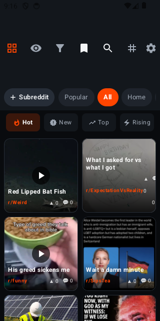
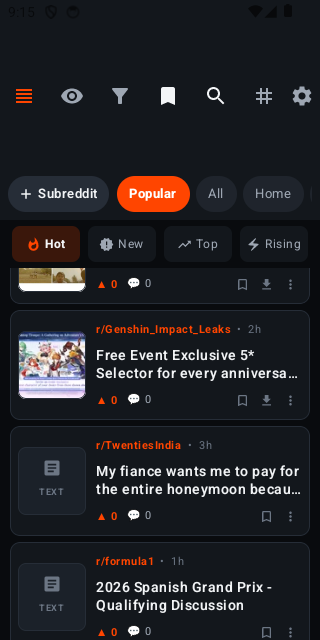
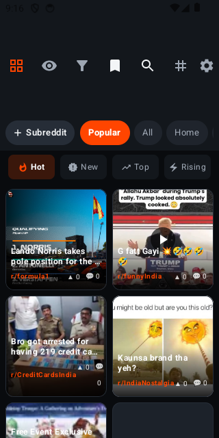
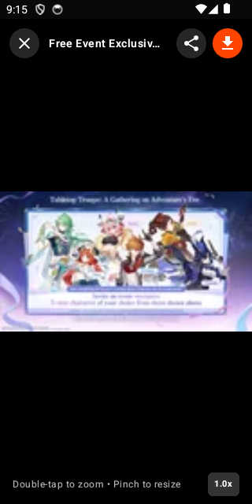
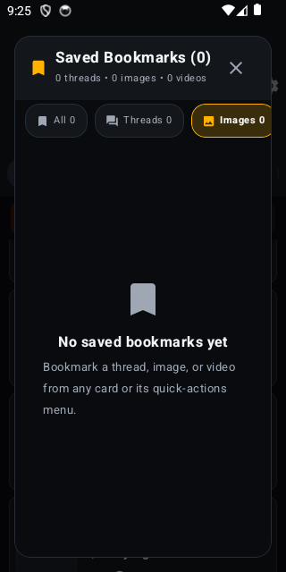

# RedX 🚀 — Next-Gen Modern Reddit Client for Android

[](https://kotlinlang.org)
[](https://developer.android.com/jetpack/compose)
[](https://m3.material.io)
[](https://www.android.com)
[](LICENSE)

**RedX** is a feature-rich, high-performance, AMOLED-optimized Reddit client designed from the ground up for modern Android phones and tablets (including Xiaomi Pad, Pixel Tablet, Samsung Galaxy Tab, and foldables).

Built using **100% Jetpack Compose**, Material 3 design tokens, hardware-accelerated media rendering, and fluid spring animations.

---

### 📥 Direct APK Download (v2.2.0)
| Build | Description | Direct Download |
|:---|:---|:---|
| **Release APK** (Recommended) | Fully optimized release build (v2.2.0) — R8 minimized, signed & ready to install | [⬇️ Download `redx.apk`](https://github.com/rishabh4496/RedX/raw/main/redx.apk) |
| **Release Binary** | Direct mirror of release binary | [⬇️ Download `redx-release.apk`](https://github.com/rishabh4496/RedX/raw/main/redx-release.apk) |
| **Debug APK** | Developer build with debug logs enabled | [⬇️ Download `redx-debug.apk`](https://github.com/rishabh4496/RedX/raw/main/redx-debug.apk) |
| **GitHub Releases** | Release tags, changelogs, and APK assets | [🏷️ View v2.2.0 Release](https://github.com/rishabh4496/RedX/releases/tag/v2.2.0) |

---

## 📸 Screenshots

| AMOLED Feed | Apollo Style | Compact / RIF Style |
|:---:|:---:|:---:|
|  |  |  |

| Multi-Image Gallery | Pinch-to-Zoom Lightbox | Settings & Customization |
|:---:|:---:|:---:|
|  |  |  |

---

## ✨ Key Features

### 🎨 10 Adaptive Viewing Styles
Switch seamlessly between different viewing ergonomics:
1. **Cards**: Clean modern cards with inline video playback, vote bars, and badges.
2. **Compact (RIF Classic)**: High-density post list with left thumbnails and quick-action rows.
3. **Magazine Grid**: Pinterest-style multi-column masonry layout optimized for tablets.
4. **Relay Style**: Full-swipe drawer with contextual upvote, save, comment, and menu actions.
5. **Apollo Style**: Sleek iOS-inspired pill cards with subtle borders and typography.
6. **Full Bleed**: Immersive edge-to-edge media cards.
7. **Big Tiles**: Large media showcase tiles.
8. **Streamline**: Minimalist clean list with streamlined meta info.
9. **Social Chat**: Chat bubble thread styling for casual browsing.
10. **Gallery View**: High-density media wall for image and video subreddits.

### 📱 Tablet & Large Screen Optimization
- **Dual-Pane Split View**: Browse the feed on the left (420dp) while reading post threads on the right.
- **Magazine Grid Mode**: Responsive multi-column layout on wide screens.
- **Xiaomi Pad 7 & Tablet Tested**: Custom layout adaptations, smooth touch targets, and orientation transition preservation.

### 👆 Swipe Gestures with Spring Physics
- **Swipe Right**: Upvote post with orange reveal and haptic feedback.
- **Swipe Left**: Save / bookmark post with gold reveal.
- **Swipe from either screen edge**: Move between Home and your subscribed subreddits with circular previous/next navigation.
- Edge navigation is paused while searching or using Multi-Subreddit mode, so existing card gestures keep their meaning.
- Enabled across Compact, Relay, Apollo, Streamline, Full Bleed, and Magazine styles.

### 🌟 Award Badges & Community Flairs
- Parses native Reddit awards (`all_awardings`) and renders gilded `★ {count}` badges.
- Styled, clickable community flairs with active flair filtering.

### 🔄 Pull-to-Refresh
- Native Material 3 `PullToRefreshBox` gesture on feed lists with spring mechanics.

### 🌐 Multi-Subreddit Combined Feeds
- Combine up to 5 communities into a single synchronized stream (`r/android+technology+science`).
- Quick-picker dialog with suggestions and custom subreddit entry.
- Persistent Multi-Feed banner with instant one-tap exit.

### ⏳ Offline "Read Later" Queue
- Bookmark articles and threads to read later.
- Local storage with relative time tracking (`5m ago`, `2h ago`, `3d ago`).
- Open directly in external browser or in-app reader.

### 👤 User Profile Viewer
- Tap any `u/username` to inspect their public submitted posts, karma, and thread history without leaving the app.

### 🔁 Native Crossposting
- Crosspost any submission to another subreddit with destination autocompletion and custom title editing.

### 🎥 Full HD Media Player & Pinch-to-Zoom Lightbox
- **ExoPlayer (Media3)**: Smooth HLS (`.m3u8`), DASH, and MP4 playback with audio controls.
- **Multi-Image Galleries**: Swipe through Reddit album galleries.
- **Gesture Lightbox**: 5x pinch-to-zoom and pan support for ultra-high-resolution images.

### 🛡️ Content Filters & Privacy
- Custom keyword blocking and domain blacklisting.
- AMOLED Pure Black mode for maximum battery conservation on OLED screens.

---

## 🛠️ Architecture & Tech Stack

- **Language**: Kotlin 2.3.20 (JVM Toolchain 17)
- **UI Framework**: Jetpack Compose (BOM 2026.03.01) + Material 3
- **Asynchronous Logic**: Kotlin Coroutines & `StateFlow`
- **Networking**: OkHttp 5.3
- **Image Loading**: Coil 2.7 with GIF & SVG decoders
- **Media Playback**: AndroidX Media3 ExoPlayer 1.11.0 (Core, HLS, DASH, UI)
- **Architecture**: MVI / Single-State ViewModel pattern (`RedXUiState`)

---

## 🚀 Building From Source

### Prerequisites
- Android Studio Ladybug / Meerkat or newer
- JDK 17
- Android SDK 36 (Platform 36, Build Tools 36.0.0)

### Clone & Build
```bash
git clone https://github.com/rishabh4496/RedX.git
cd RedX

# Compile and run unit tests
./gradlew testDebugUnitTest

# Assemble an optimized release APK (unsigned unless signing is configured locally)
./gradlew assembleRelease
```
The output APK will be located at:
`app/build/outputs/apk/release/app-release.apk`

For distributable signed binaries, configure a private release keystore in CI or in
your local Gradle environment. Release binaries are intentionally published through
GitHub Releases rather than committed to the source tree.

---

## 📦 Releases

Download the latest release APK directly from the [Releases](https://github.com/rishabh4496/RedX/releases) section.

---

## 📄 License

This project is open-source under the [MIT License](LICENSE).
RedX is an independent third-party client and is not affiliated with or endorsed by Reddit Inc.
